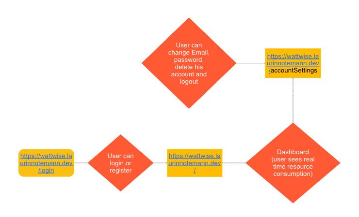
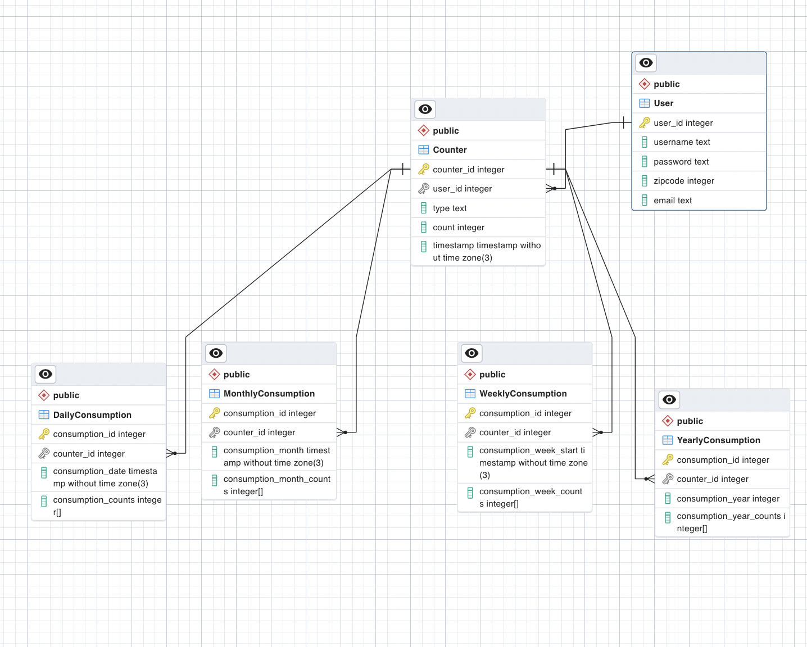
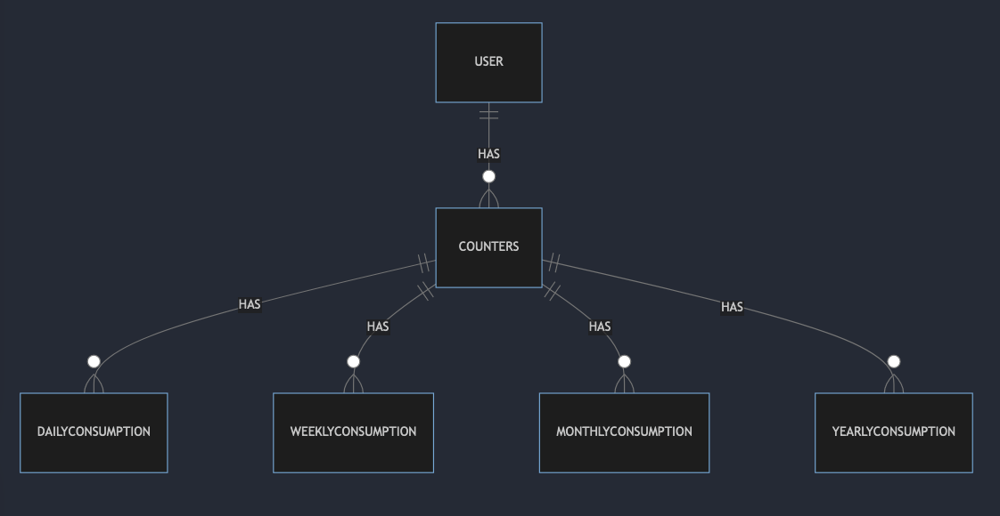

# WattWise

WattWise is an application that receives data from a sensor, saves it to a database and displays it in graphs on the dashboard. The application can be used to monitor gas, water and electricity consumption and to help users react to that and save cost.

# Architecture

# Database

## Physical Data Model

## Logical Data Model

# Installation

1. Clone the repository to your local machine.

        git clone https://github.com/lnart/WattWise.git

2. Navigate to the project directory and run npm install to install all dependencies. Please make sure you have Node.js and npm installed on your system.

        npm install
  
3. You will need to create an account on HiveMQ and set up the sensor to connect to it. In the mqttController file in this project, you can connect to the MQTT server and subscribe to the topic the sensor publishes its data to. Make sure that your topic follows this convention 'counterType/coounterId/live' and it should display your consumption.

# Usage

To start the application, run npm run dev in the project directory. This will start the server and launch the application in your browser. You can then view the dashboard and graphs of your consumption.

        npm run dev

# Dependencies

This project has several dependencies, including:

    @playwright/test
    @prisma/client
    @types/bcrypt
    @types/express
    @types/jest
    @types/node
    jest
    nodemon
    prisma
    ts-jest
    ts-node
    typescript
    vitest
    @types/cookie-parser
    @types/dotenv
    @types/ejs
    @types/jsonwebtoken
    @types/pg
    @types/uuid
    @types/ws
    bcrypt
    cookie-parser
    dayjs
    dotenv
    ejs
    express
    jsonwebtoken
    mqtt
    pg
    playwright
    uuid
    weekday
    ws
